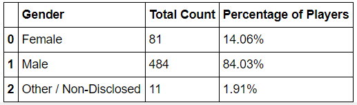
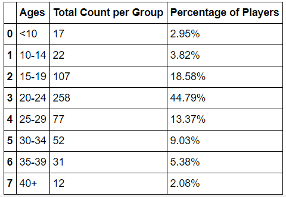
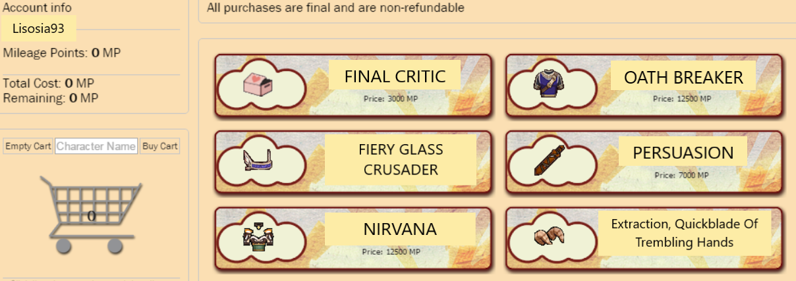

# Pandas Challenge

##                                      Pandas Homework - Pandas, Pandas, Pandas

* You've been tasked of analyzing the data for the most recent fantasy game Heroes of Pymoli. You've been asked to generate a report that breaks down the game's purchasing data inot meaningful insights. 

-----------------------------------------------------------------------------------------------------------------------

1. Men Buy, Exponentially More, Than Women

    The first observable and quite obvious trend from this data set is that men buy more games items when compared to women. In this table below the overarching dynamic in which men buy more in-game items is clearly shown. If the company would like to increase their female gamers buying habits, they could possibly push a survey while their customers are making those purchases. It would be an interesting study on whether the company can tailor the specific items to appeal to their female players or broaden their advertisements. 

     

-----------------------------------------------------------------------------------------------------------------------

2. Age matters. 
   
   Closer to half, than not, the players who buy in-game items are between the ages of 20 to 24. 20 to 24 year olds almost make up 45% of all purchaces. The assumption can be made is this age group is more likely to have disposable income. 

    

-----------------------------------------------------------------------------------------------------------------------

3. Items, Items, Items
   
   There were several items that customers repeatedly bought. For example, Final Critic item was bought 13 times which had the highest purchase count out of more than 500 items bought. The items and their attributes were not given in this data set, but analyzing the category of their most profitable items could increase the company sales. This can be used as leading indicators for the creation of items. Another possibility is the company can use this data on creating more items that customers enjoy rather than just sales. 